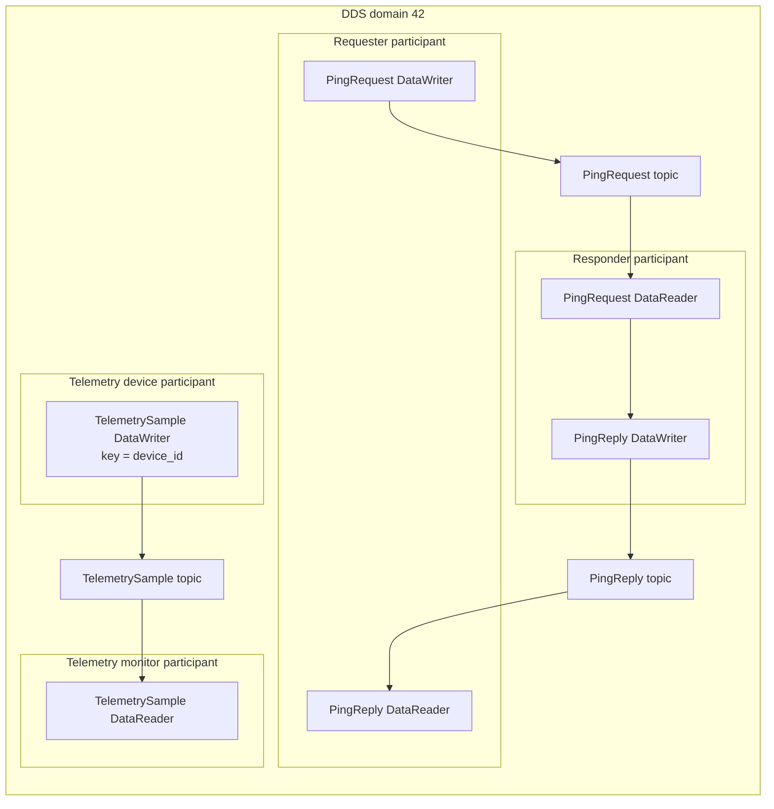
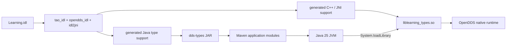

# Learning OpenDDS from the Java labs

This guide explains the project in the same order that a Java developer meets
the concepts. Run the quick start in the repository [README](../README.md)
first. Keep the source open while reading: this is a map of the working
implementation, not a replacement for the OpenDDS Developer's Guide.

## 1. Start with the data model

DDS is data-centric publish/subscribe middleware. Applications exchange
strongly typed samples on named topics. They do not call each other directly,
and there is no application-data broker in the network lab.

The project owns one IDL schema:
[`Learning.idl`](../dds-types/src/main/idl/Learning.idl). It defines three
topic types:

- `PingRequest` carries a sequence number and payload.
- `PingReply` returns the request sequence and adds a responder sequence.
- `TelemetrySample` carries a keyed `device_id`, sequence number, device
  timestamp, temperature, and humidity.

IDL is the contract shared by writers and readers. Generated classes are build
artifacts under `dds-types/target/`; edit the IDL and regenerate instead of
editing those classes.

The `@key` annotation on `device_id` gives `TelemetrySample` an identity.
DDS treats samples with the same key as successive states of one logical
instance. The monitor therefore maintains state independently for each device.

## 2. Understand the DDS entity graph

The Java applications construct the standard DDS entities in this order:

1. `DomainParticipantFactory` bootstraps the OpenDDS runtime.
2. A `DomainParticipant` joins a numeric domain.
3. Generated `TypeSupport` registers an IDL type with that participant.
4. The participant creates a named `Topic` for that registered type.
5. A `Publisher` owns one or more `DataWriter` endpoints.
6. A `Subscriber` owns one or more `DataReader` endpoints.
7. Generated helpers narrow generic endpoints to type-specific Java APIs.
8. Writers publish typed objects; readers take typed objects.
9. The application deletes contained entities, deletes the participant, and
   shuts down `TheServiceParticipant`.

A **domain** is an isolation boundary. Participants in domain 42 do not match
participants in domain 43.

A **participant** is one process's presence in a domain. Each command-line Java
role creates its own participant.

A **topic** combines a name, registered type, and QoS contract. Matching needs
compatible domain, topic name, type, and QoS.

A **publisher** and **subscriber** are containers for endpoints. The
`DataWriter` and `DataReader` perform the actual sample exchange.

The runtime flow is:



The complete diagram source, including discovery and transport planes, is in
[`runtime-flow.mmd`](diagrams/runtime-flow.mmd).

## 3. Separate discovery from data transport

Discovery and application-data transport solve different problems.

**Discovery** tells participants that compatible writers and readers exist and
provides the information needed to associate them.

**Transport** carries application samples after compatible endpoints match.

The shared-memory lab uses a central `DCPSInfoRepo` for discovery. The
repository coordinates endpoint discovery; it does not relay ping or telemetry
samples. Those samples use OpenDDS `shmem` inside one container and one IPC
namespace.

The network lab has no central discovery service. RTPS Simple Participant
Discovery Protocol (SPDP) finds participants, and Simple Endpoint Discovery
Protocol (SEDP) exchanges endpoint information. The project supplies explicit
unicast peer addresses because Docker multicast behavior varies by host.
Application samples then use a separate `rtps_udp` transport instance.

This distinction explains why a process can discover a peer yet still fail to
exchange data: discovery succeeded, but transport reachability, transport
compatibility, or endpoint QoS can still prevent useful communication.

Read the concrete settings in
[`docker/config/README.md`](../docker/config/README.md) after this section.

## 4. Follow IDL through Java and JNI

OpenDDS is implemented in C++. Its Java binding uses JNI, so an application
type needs both generated Java classes and generated native code.



The complete diagram source is in
[`build-and-jni.mmd`](diagrams/build-and-jni.mmd).

The build has four relevant layers:

1. [`Learning.mpc`](../dds-types/src/main/mpc/Learning.mpc) describes the
   OpenDDS code-generation project.
2. [`generate.sh`](../dds-types/scripts/generate.sh) runs MPC and GNU Make in
   the configured OpenDDS environment. A source fingerprint prevents stale
   generated output and forces regeneration when the IDL or MPC input changes.
3. The `dds-types` Maven module packages generated Java classes and the native
   `liblearning_types.so` for the current Linux architecture.
4. [`NativeTypeSupport`](../dds-types/src/main/java/io/github/tmejs/opendds/types/NativeTypeSupport.java)
   loads that application native library before generated type support is used.

The OpenDDS Java runtime also needs four JARs and the OpenDDS/ACE/TAO native
libraries. The builder image installs the JARs in its image-local Maven
repository. [`run-dds-java.sh`](../scripts/run-dds-java.sh) assembles the
application classpath, sets `java.library.path`, enables native access for the
unnamed module, and passes the selected OpenDDS configuration file.

This is why adding a normal Java dependency is not enough. The Java bytecode,
application JNI library, and OpenDDS native runtime must agree on platform and
version.

## 5. Read the ping/pong path

The requester owns a `PingRequest` writer and `PingReply` reader. The
responder owns the inverse endpoints. Before measuring, the requester waits for
both of its endpoints to associate with the responder. The responder creates
its endpoints and then waits for reader-listener activity. This avoids guessing
with a fixed startup sleep while putting the explicit association checks in the
requester.

For each measured exchange the requester:

1. chooses a sequence number;
2. records `System.nanoTime()`;
3. writes one request;
4. waits for the reply with that same sequence;
5. records the elapsed monotonic time.

The correlation rule matters because a reader can observe delayed, duplicate,
or unrelated samples.
[`PingReplyWaiter`](../ping-requester/src/main/java/io/github/tmejs/opendds/ping/PingReplyWaiter.java)
keeps the original deadline while ignoring unrelated replies; unrelated data
does not extend the timeout.

`System.nanoTime()` is appropriate for elapsed time because it is monotonic.
Wall-clock time can jump when the operating system corrects its clock.

### Warmup

The first exchanges can include JIT compilation, class loading, native
initialization, allocation, and transport association effects. The requester
can run warmup exchanges and excludes them from `PING_LATENCY`. The launchers
default to zero; set `DDS_WARMUP_COUNT` when comparing modes. Warmup makes
steady-state comparisons more useful but does not remove scheduler or container
noise.

### Percentiles

[`LatencyStatistics`](../ping-requester/src/main/java/io/github/tmejs/opendds/ping/LatencyStatistics.java)
uses the nearest-rank definition. For sorted values and percentile `p`, the
one-based rank is:

```text
ceil(p * sampleCount)
```

The code converts that rank to a zero-based list index. With only ten samples,
p95 and p99 both select the maximum. Use a larger count before drawing a tail
latency conclusion.

The measured round trip includes the Java loop, JNI calls, serialization,
OpenDDS queues, transport, responder work, container scheduling, and the return
path. It is an application-level comparison, not raw link latency.

## 6. Read the telemetry path

The device registers the `device_id` key and publishes an increasing sequence
with values. The monitor's reader listener updates a
[`TelemetryTracker`](../telemetry-monitor/src/main/java/io/github/tmejs/opendds/telemetry/TelemetryTracker.java)
for each key.

A forward jump from sequence 1 to sequence 4 counts two missing samples.
Duplicate and older samples do not replace the latest displayed state. This
makes loss or reordering visible without assuming that every device shares one
global sequence.

The sample contains a device wall-clock timestamp because event time is useful
domain data. The monitor does not use two wall clocks to calculate freshness.
It records local `System.nanoTime()` when a sample arrives, then computes how
long that local monitor has waited for a newer sample. This avoids reporting
clock skew as transport delay.

After the finite device stops, the monitor waits until the latest value reaches
`--stale-after-ms`. The final `stale=true` demonstrates an operational
state transition, not a DDS durability feature.

## 7. Change QoS deliberately

QoS participates in endpoint compatibility and behavior. These labs expose:

- `--reliability reliable|best-effort`
- `--history-depth N`, implemented as `KEEP_LAST(N)`

Reliable delivery requests acknowledgement and repair behavior. Best effort
allows loss. `KEEP_LAST` bounds retained samples per instance; it does not
make volatile samples durable and cannot recreate a lost best-effort datagram.

The launcher applies the selected QoS to both ends. Matching Reliability keeps
the reader's requested policy compatible with the writer's offered policy.
History does not determine endpoint association; using the same depth on both
ends makes their bounded cache behavior symmetric and easier to compare.

Change one policy at a time:

```bash
./scripts/run-network.sh --scenario telemetry --count 100 \
  --reliability reliable --history-depth 10 \
  --interval-ms 5 --stale-after-ms 100

./scripts/run-network.sh --scenario telemetry --count 100 \
  --reliability best-effort --history-depth 10 \
  --interval-ms 5 --stale-after-ms 100
```

A finite best-effort run expects the monitor to receive the same count the
device sends. If a sample is lost, the monitor prints the gap but cannot reach
its receive target, so the outer scenario timeout makes the experiment fail
visibly. For sustained loss experiments, give the monitor an independent
receive target or run it unbounded.

## 8. Perform focused exercises

### Exercise A: compare transport modes

Run at least five trials of each ping mode with the same count and no other
intentional system load:

```bash
DDS_WARMUP_COUNT=20 ./scripts/run-shared-memory.sh --scenario ping --count 1000
DDS_WARMUP_COUNT=20 ./scripts/run-network.sh --scenario ping --count 1000
```

Record p50, p95, and p99 with machine load and container resource limits.
Compare distributions and repeatability, not one winning sample.

### Exercise B: prove domain isolation

```bash
./scripts/run-network.sh --scenario ping --count 1 \
  --timeout-seconds 3 --requester-domain 43 --responder-domain 42
```

The expected result is non-zero with:

```text
PING_SUMMARY status=TIMEOUT received=0 expected=1
```

Network reachability alone does not cross a DDS domain boundary.

### Exercise C: inspect generated type support

After `mvn clean verify`, inspect `dds-types/target/generated-sources/` and
the architecture-specific native directory under `dds-types/target/`. Trace
`TelemetrySampleDataWriterHelper.narrow` from an application to its generated
class. Then run the dedicated incremental-generation regression:

```bash
./dds-types/scripts/test-idl-regeneration.sh
```

The script builds an archived checkout, renames the `PingReply` topic type,
rebuilds without `clean`, and confirms the renamed class exists while the
removed `PingReply.class` does not. A type rename or removal exercises
stale-class cleanup; a field rename only regenerates the same type class.

### Exercise D: observe keyed state

Extend the Compose topology with a second telemetry device and a different
`--device-id`. Confirm the monitor reports `devices=2` and tracks sequences
and staleness independently.

### Exercise E: create a controlled sequence gap

A deterministic unit exercise can add samples with sequences 1 and 4 to
`TelemetryTrackerTest` and assert that the missing count is 2. A
transport-level gap requires deliberate loss or a publisher sequence jump.
Read the printed sequences before inferring a middleware defect.

### Exercise F: vary one QoS policy

Hold count, interval, transport, and machine load constant. Change reliability,
then restore it and change history depth. Record matching behavior and gaps.
Changing multiple policies at once prevents a useful causal conclusion.

## 9. Interpret shutdown correctly

OpenDDS owns native threads and resources. Every Java role uses a `finally`
path to delete contained entities, delete its participant, and call
`TheServiceParticipant.shutdown()`. The Compose launchers also enforce an
outer timeout and clean up sibling processes.

A correct result includes both the application summary and clean process exit.
A summary followed by a hung container is still a lifecycle defect.

## 10. Know the current boundary

Network mode proves RTPS/UDP between containers on one Docker bridge. A
cross-host deployment adds advertised addresses, host routing, firewall and UDP
port policy, and possibly a relay or explicit peer list. It is a separate
deployment checkpoint, not something the current same-host result proves.

DDS Security, persistent durability, failover, schema evolution, deployment
packaging, and production metrics also remain future work.

Continue with the official
[OpenDDS Java Bindings guide](https://opendds.readthedocs.io/en/latest-release/devguide/java_bindings.html)
and
[run-time configuration reference](https://opendds.readthedocs.io/en/latest-release/devguide/run_time_configuration.html).
Use [troubleshooting](troubleshooting.md) to map failures to the layer that can
cause them.
